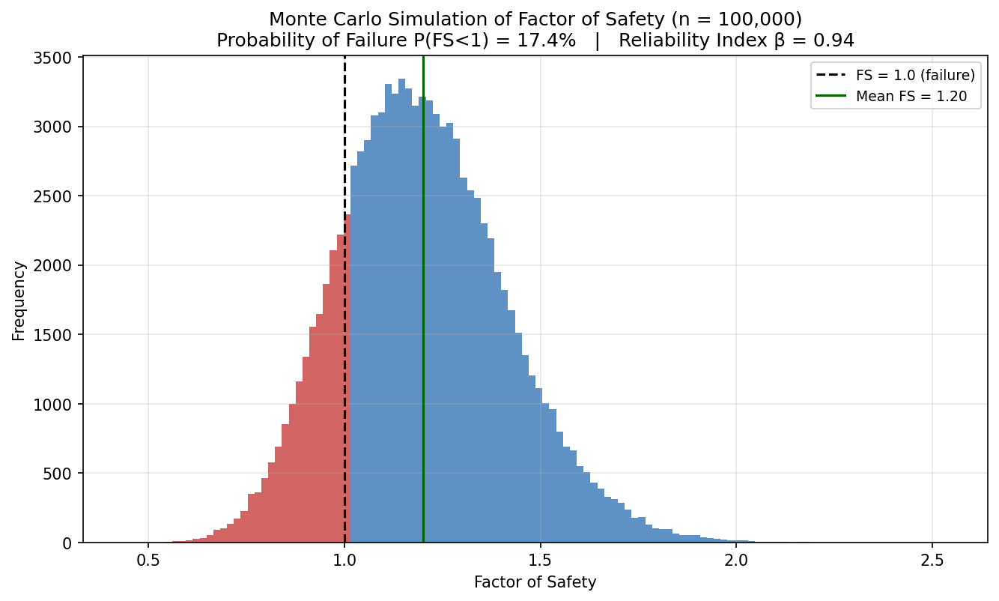
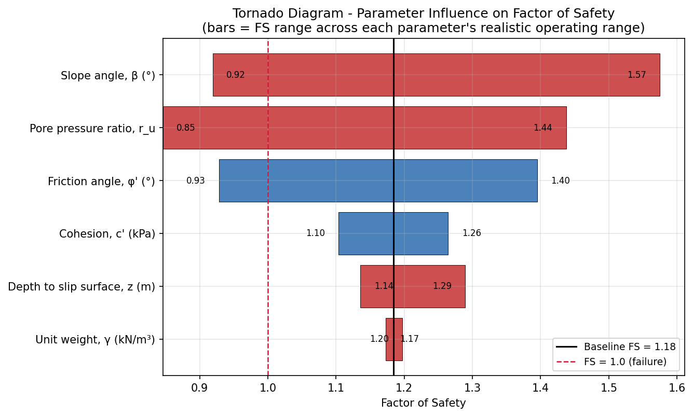
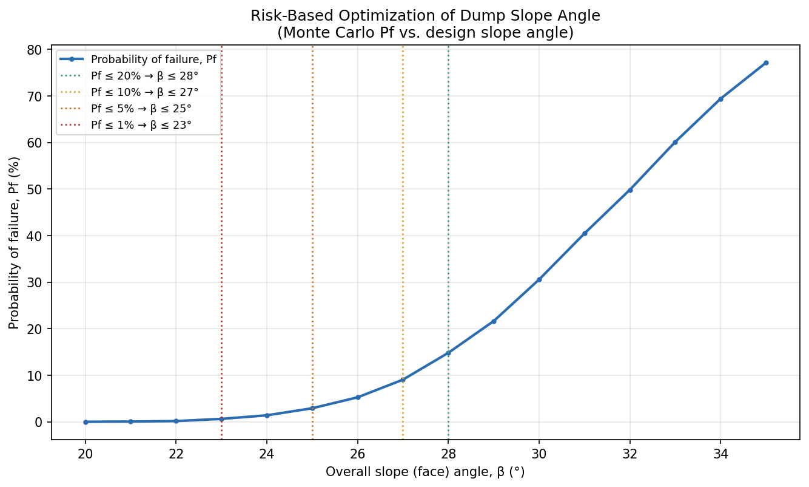

# Probabilistic Slope Stability Assessment of a Mine Waste Dump


A reliability-based slope stability analysis of an open-pit mine waste rock dump —
built in Python, with a deterministic Factor-of-Safety model, sensitivity analysis,
a 100,000-trial Monte Carlo simulation, risk-based design optimization, and an
audit-ready Excel workbook with live formulas.

Instead of stopping at a single deterministic Factor of Safety, this project asks
the question a risk-aware geotechnical engineer actually needs answered: **given
realistic uncertainty in the input parameters, what is the probability this slope
fails — and how steep can it safely be built?**



## Table of contents

- [Method](#method)
- [Results at a glance](#results-at-a-glance)
- [Repository structure](#repository-structure)
- [Getting started](#getting-started)
- [The Excel deliverable](#the-excel-deliverable)
- [Limitations](#limitations)
- [License](#license)

## Method

The core model is the **infinite-slope method** with seepage parallel to the slope
face, using the pore-pressure ratio `r_u` (Bishop & Morgenstern, 1960). This is the
standard first-pass screening tool for planar, near-surface failures in engineered
waste dumps — appropriate here because dumps are built as long, uniform benches
where shallow face-parallel sliding is the dominant failure mode, and because a
closed-form model is fast enough to evaluate hundreds of thousands of times in a
Monte Carlo simulation.

```
FS = [c' + (γ·z·cos²β − r_u·γ·z)·tan φ'] / (γ·z·sin β·cos β)
```

| Symbol | Meaning | Baseline value |
|---|---|---|
| `c'`    | Effective cohesion              | 15 kPa |
| `φ'`    | Effective friction angle        | 35°    |
| `γ`     | Bulk unit weight                | 20 kN/m³ |
| `z`     | Depth to slip surface           | 15 m   |
| `β`     | Slope (face) angle              | 28°    |
| `r_u`   | Pore-pressure ratio             | 0.15   |

Baseline FS = **1.184** — a deliberately marginal design, chosen so the sensitivity
and Monte Carlo analyses show meaningful movement across the FS = 1 failure
threshold rather than sitting safely on one side of it.

The analysis then proceeds in three stages:

1. **Sensitivity analysis** — one-at-a-time parameter sweeps and a tornado diagram
   to identify which inputs actually drive the outcome.
2. **Monte Carlo simulation** — 100,000 trials with every input treated as a
   truncated-normal random variable, yielding an actual probability of failure
   instead of a single point estimate.
3. **Risk-based optimization** — re-running the full simulation at each candidate
   slope angle to produce a design curve: pick a slope angle for a target risk
   level, rather than designing to FS alone.

## Results at a glance

**Sensitivity** — slope angle and pore-pressure ratio dominate; unit weight is
nearly irrelevant to FS over its realistic range.



**Monte Carlo** — 100,000 trials give a probability of failure **Pf = P(FS<1) ≈ 17.4%**
and reliability index **β ≈ 0.94** for the baseline (marginal) design.

| Statistic | Value |
|---|---|
| Mean FS | 1.20 |
| Std. dev. FS | 0.21 |
| Probability of failure, Pf | 17.4% |
| Reliability index, β | 0.94 |

**Risk-based optimization** — the steepest slope angle meeting common risk targets:

| Target Pf | Recommended slope angle |
|---|---|
| ≤ 20% | 28° |
| ≤ 10% | 27° |
| ≤ 5%  | 25° |
| ≤ 1%  | 23° |



## Repository structure

```
.
├── core.py            # deterministic FS model (scalar + vectorized for Monte Carlo)
├── sensitivity.py      # one-at-a-time parameter sweeps + tornado diagram data
├── monte_carlo.py      # 100,000-trial probabilistic simulation
├── optimization.py     # risk-based slope-angle optimization
├── make_plots.py       # generates every figure in this repo
├── build_excel.py      # assembles the Excel workbook, below
├── Waste_Dump_Slope_Stability_Assessment.xlsx   # audit-ready workbook, live formulas
├── *.png               # generated figures (schematic, sensitivity, Monte Carlo, risk curve)
├── requirements.txt
└── LICENSE
```

## Getting started

```bash
git clone https://github.com/chrohitkumar/Slope-stability-analysis.git
cd Slope-stability-analysis
pip install -r requirements.txt

python3 core.py            # baseline deterministic FS
python3 sensitivity.py     # one-at-a-time sweeps + tornado data
python3 monte_carlo.py     # 100,000-trial simulation summary
python3 optimization.py    # slope-angle risk optimization
python3 make_plots.py      # regenerates every PNG in this repo
python3 build_excel.py     # regenerates the Excel workbook
```

Everything is deterministic and reproducible: the Monte Carlo simulation uses a
fixed random seed, so re-running `monte_carlo.py` reproduces the exact Pf and
reliability index reported above.

## The Excel deliverable

`Waste_Dump_Slope_Stability_Assessment.xlsx` makes the analysis auditable without
reading a line of Python:

- Baseline inputs are editable cells; the FS formula is written as an actual Excel
  formula (using `RADIANS()` for the trig), not a value pasted in from Python — so
  changing an input recalculates everything downstream live.
- A **2,000-row, formula-driven Monte Carlo sample** shows exactly how FS is
  computed from six sampled inputs, row by row, with `AVERAGE` / `STDEV` / `COUNTIF`
  summary formulas — alongside the full 100,000-trial Python-computed summary for
  the headline numbers.
- Every chart from this README is embedded directly in the workbook.
- Verified with zero formula errors across 2,155 formulas on recalculation.

## Limitations

- The infinite-slope method assumes a slope-parallel failure plane; it does not
  capture deep rotational or wedge failures, or foundation failure beneath the dump.
- Inputs are sampled independently. In reality, `c'` and `φ'` are commonly
  (negatively) correlated, since both are typically fit from the same shear-test
  regression line — ignoring this correlation likely makes the reported Pf a
  conservative overestimate.
- Pore pressure is simplified to a single ratio `r_u`, rather than a full
  transient seepage analysis driven by rainfall and drainage design.
- This is a methodology and workflow demonstration built with illustrative
  baseline parameters — not a certified site-specific design. Any real waste
  dump design must be reviewed by a qualified geotechnical engineer of record
  and follow applicable regulatory guidance.

## License

MIT — see [LICENSE](LICENSE).
